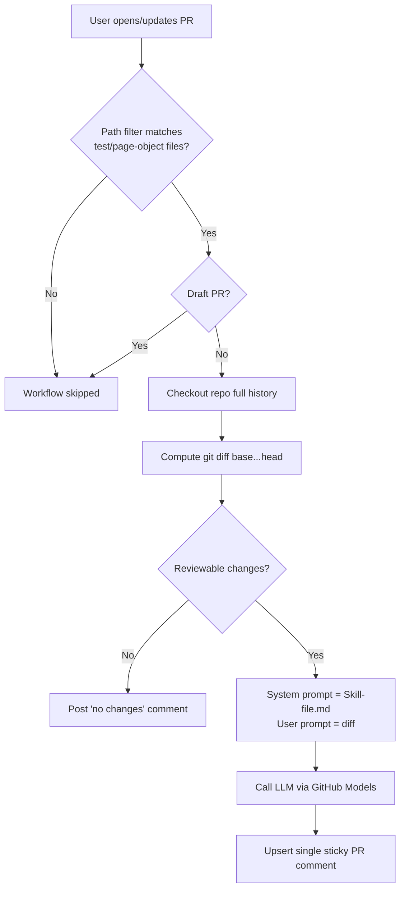

# AI Code Reviewer — Playwright/TypeScript

An automated Pull Request reviewer for Playwright + TypeScript test-automation
repositories. It reviews every PR with the strictness of a **Principal QA
Architect**, applying 17 categories of automation, architecture, and
Playwright best-practice checks, and posts the findings as a single sticky
comment on the PR.

The reviewer's entire personality, rule set, severity model, and output format
live in [`Skill-file.md`](Skill-file.md). A small zero-dependency Node script
sends that file to an LLM (GitHub Models by default) together with the PR diff,
and publishes the result back to the PR.

---

## Table of contents

- [What it does](#what-it-does)
- [How it works](#how-it-works)
- [Project structure](#project-structure)
- [Prerequisites](#prerequisites)
- [Setup](#setup)
- [Triggering a review](#triggering-a-review)
- [Configuration](#configuration)
- [The review output](#the-review-output)
- [Customizing the reviewer](#customizing-the-reviewer)
- [Local testing](#local-testing)
- [Troubleshooting](#troubleshooting)
- [Limitations](#limitations)
- [Using this on Azure DevOps](#using-this-on-azure-devops)

---

## What it does

When a developer opens or updates a PR, the reviewer:

- Reads **only the changed lines** (with surrounding diff context) of relevant
  files.
- Evaluates them across 17 categories: Page Object violations, locator quality,
  Playwright best practices, assertion quality, retry misuse, hard waits,
  reporting completeness, naming, test design, framework design, performance,
  stability, security, code quality, TypeScript quality, and Playwright
  architecture.
- Assigns a severity (`CRITICAL` / `HIGH` / `MEDIUM` / `LOW` / `INFO`) to each
  finding, explains **why it matters**, and provides a **recommended fix**.
- Produces a scored PR summary, a strengths section, an architecture rating,
  and a final decision (`APPROVE` / `APPROVE WITH COMMENTS` /
  `REQUEST CHANGES` / `REJECT`).

> This is an **advisory** reviewer. It posts a comment; it does not (by default)
> submit a formal GitHub review status or block merges.

---

## How it works



Step by step:

1. **Trigger** — GitHub Actions fires on `pull_request` events
   (`opened`, `synchronize`, `reopened`, `ready_for_review`) **filtered to
   test/page-object paths**, or on a manual `workflow_dispatch` with a PR number.
2. **Checkout** with full history (`fetch-depth: 0`) so the `base...head` diff
   can be computed.
3. **Diff** — the script runs `git diff base...head`, filters to reviewable
   files (`.ts`, `.tsx`, `.js`, `.jsx`, `.mjs`, `.cjs`, `.json`, `.yml`),
   excluding `node_modules`.
4. **Prompting** — [`Skill-file.md`](Skill-file.md) becomes the **system
   prompt**; the changed-file list plus unified diff becomes the **user
   prompt**. The diff is truncated at 200,000 characters to avoid token
   overflow.
5. **Model call** — sent to **GitHub Models** using the built-in `GITHUB_TOKEN`
   (no external account needed).
6. **Publish** — the review is posted as a single **sticky** PR comment
   (identified by a hidden marker). Re-runs update the same comment in place
   instead of spamming new ones.

---

## Project structure

```
.
├── Skill-file.md                       # The reviewer persona, rules & output format (system prompt)
├── README.md                           # This file
└── .github/
    ├── workflows/
    │   └── ai-code-review.yml          # GitHub Actions workflow (triggers + permissions)
    └── scripts/
        └── ai-code-review.mjs          # Zero-dependency Node review script
```

| File | Responsibility |
|------|----------------|
| [`Skill-file.md`](Skill-file.md) | All reviewer behavior: identity, 17 categories, severity table, output format, decision rules. Edit this to change *what* and *how* it reviews. |
| [`.github/workflows/ai-code-review.yml`](.github/workflows/ai-code-review.yml) | Defines *when* the reviewer runs, its permissions, and which env vars are passed to the script. |
| [`.github/scripts/ai-code-review.mjs`](.github/scripts/ai-code-review.mjs) | The runtime: computes the diff, calls the model, posts the comment. |

---

## Prerequisites

- A repository hosted on **GitHub** (see [Azure DevOps note](#using-this-on-azure-devops)
  if you are on ADO).
- **GitHub Actions enabled** for the repository.
- **GitHub Models access** enabled for your account/organization
  (Settings → Models, or org policy). This works out of the box on most
  personal repositories.
- **Node.js 20+** — provided automatically by the workflow; only needed locally
  if you want to run the script by hand.

No external API keys or secrets are required when using GitHub Models.

---

## Setup

1. **Copy these files** into the root of your Playwright/TypeScript automation
   repository, preserving paths:
   - `Skill-file.md`
   - `.github/workflows/ai-code-review.yml`
   - `.github/scripts/ai-code-review.mjs`

2. **Confirm permissions.** The workflow already declares the permissions it
   needs:

   ```yaml
   permissions:
     contents: read
     pull-requests: write   # to post the review comment
     models: read           # to call GitHub Models
   ```

   In **Settings → Actions → General → Workflow permissions**, ensure workflows
   are allowed to run. If your organization restricts the default token, allow
   PR write and Models read.

3. **(Optional) Pick a model.** Add a repository **Variable** named `MODEL`
   under Settings → Secrets and variables → Actions → Variables. Defaults to
   `openai/gpt-4o`. For lower cost/latency use e.g. `openai/gpt-4o-mini`.

4. **Commit and push.** Open a PR that touches a test or page-object file and
   the review will appear automatically.

---

## Triggering a review

### Automatically (on a PR)

The reviewer runs when a PR is opened, updated, reopened, or marked ready —
**only if** the PR changes files matching the path filter:

```
**/*.spec.ts   **/*.test.ts   **/*.spec.js   **/*.test.js
**/*Page.ts    **/*.page.ts
**/pages/**    **/page-objects/**   **/fixtures/**   **/tests/**
playwright.config.*
```

Draft PRs are skipped.

### Manually (any PR)

1. Go to the **Actions** tab → **AI Code Reviewer**.
2. Click **Run workflow**.
3. Enter the **PR number** and run. The script fetches that PR's base/head from
   the API and reviews it.

---

## Configuration

All configuration is optional. Defaults are baked in.

| Name | Type | Default | Purpose |
|------|------|---------|---------|
| `MODEL` | Actions Variable | `openai/gpt-4o` | Which GitHub Models model to use. |
| `MODELS_ENDPOINT` | env (script) | `https://models.github.ai/inference/chat/completions` | Override to point at another OpenAI-compatible endpoint. |
| `SKILL_FILE_PATH` | env (script) | `Skill-file.md` | Path to the persona/rules file. |
| `MAX_DIFF_CHARS` | constant (script) | `200000` | Diff truncation limit to stay within token limits. |
| Path filter | workflow `paths:` | see above | Restricts which file changes trigger the review. |

---

## The review output

The reviewer posts (and keeps updating) one comment containing:

- **PR Summary** — a scored table (Overall, Architecture, Maintainability, Test
  Stability, Playwright Compliance, Production Readiness; each 1–10).
- **Review Findings** — one block per issue with severity, file, line,
  problem, why it matters, and a concrete recommended fix.
- **Strengths** — specific, non-manufactured praise.
- **Architecture Rating** — a one-paragraph assessment.
- **Decision** — `APPROVE`, `APPROVE WITH COMMENTS`, `REQUEST CHANGES`, or
  `REJECT`, with a one-sentence justification.

Severity meanings:

| Severity | Meaning |
|----------|---------|
| `CRITICAL` | Flaky execution, architecture violation, or security issue. |
| `HIGH` | Framework convention violation; scales poorly. |
| `MEDIUM` | Maintainability issue; compounding technical debt. |
| `LOW` | Readability/naming/style. |
| `INFO` | Suggestion, not a defect. |

---

## Customizing the reviewer

- **Change the rules or tone** → edit [`Skill-file.md`](Skill-file.md). It is
  the single source of truth for behavior; no code changes needed.
- **Change which files trigger it** → edit the `paths:` list in
  [`.github/workflows/ai-code-review.yml`](.github/workflows/ai-code-review.yml).
- **Change which file types are diffed** → edit the `REVIEWABLE` regex in
  [`.github/scripts/ai-code-review.mjs`](.github/scripts/ai-code-review.mjs).
- **Change the model** → set the `MODEL` repository Variable.

---

## Local testing

You can run the script locally against a real PR by emulating the Actions
environment. You need a GitHub token with `repo` scope and a minimal event
payload file.

```powershell
# 1. Create a minimal event payload referencing a real PR's SHAs.
$event = @{
  pull_request = @{
    number = 123
    base = @{ sha = "<base-sha>" }
    head = @{ sha = "<head-sha>" }
  }
} | ConvertTo-Json -Depth 5
$event | Out-File event.json -Encoding utf8

# 2. Set env vars and run.
$env:GITHUB_EVENT_PATH = "$PWD\event.json"
$env:GITHUB_REPOSITORY = "owner/repo"
$env:GITHUB_TOKEN      = "<your-token>"
$env:GITHUB_EVENT_NAME = "pull_request"
node .github/scripts/ai-code-review.mjs
```

> GitHub Models requires a token from a context with Models access. If running
> outside Actions fails the model call, test the diff/comment logic against a
> different OpenAI-compatible endpoint via `MODELS_ENDPOINT`.

---

## Troubleshooting

| Symptom | Likely cause | Fix |
|---------|--------------|-----|
| Workflow never runs on a PR | PR didn't touch a path in the `paths:` filter, or PR is a draft | Adjust the filter, or mark the PR ready. |
| `GitHub Models request failed (403)` | Models access not enabled / `models: read` missing | Enable GitHub Models; confirm the permission block. |
| `GitHub API ... failed (403)` when commenting | `pull-requests: write` not granted | Allow PR write in repo/org Actions settings. |
| "No reviewable changes" comment | Only non-code files changed | Expected; nothing to review. |
| Review seems to miss part of a huge PR | Diff exceeded 200k chars and was truncated | Split the PR, or raise `MAX_DIFF_CHARS`. |
| Manual run fails | Missing/invalid `pr_number` input | Provide a valid open PR number. |

---

## Limitations

- **GitHub-only.** Built for GitHub Actions and the GitHub API.
- **Advisory, not blocking.** Posts a comment; does not set a required-check
  status by default.
- **LLM variability.** Output is model-generated; quality depends on the model
  and may vary between runs.
- **Token/rate limits.** GitHub Models enforces usage limits; very large or
  high-volume PRs may be throttled.
- **Diff truncation.** Extremely large PRs are truncated to fit token limits.

---

## Using this on Azure DevOps

This project is GitHub-specific and will **not** run on Azure DevOps as-is.
The review *logic* (read `Skill-file.md`, build the diff, call an LLM) is
reusable, but the following must be rewritten for ADO:

- The workflow → an **Azure Pipelines** `azure-pipelines.yml` with a PR trigger
  or branch-policy build validation.
- Auth → `System.AccessToken` instead of `GITHUB_TOKEN`.
- Comment posting → the **Azure DevOps REST API** (PR threads) instead of the
  GitHub API.
- The model → GitHub Models is unavailable; use **Azure OpenAI** (a natural fit
  for ADO shops) or another provider.

If you need the ADO version, adapt the script's comment/auth layer and provide
an Azure OpenAI endpoint, key, and deployment name.
